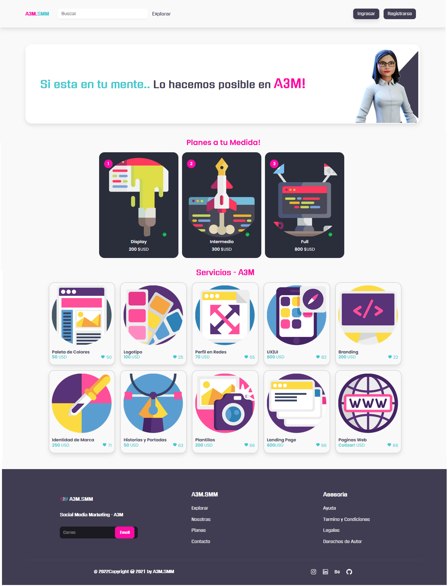

Whoami!⚡

<h1 align="center">Hi 👋, I'm A3M Social Media Marketing</h1>

<div align="center">
    <h1> </h1>
</div>

# Descripcion
Disfrutamos creando experiencias centradas en el usuario con un toque virtual y digital. 


# Tecnologias usadas
   
      
## Vista de Website A3M
[Demo](https://a3m-smm.netlify.app/)

## Build Setup

``` bash
# clone project
$ git clone https://github.com/A3M-SMM/A3M-SMM-ECOMMERCE.git

# install dependencies
$ npm install

# serve with host at localhost:8000
$ npm start
```

# Screenshot



